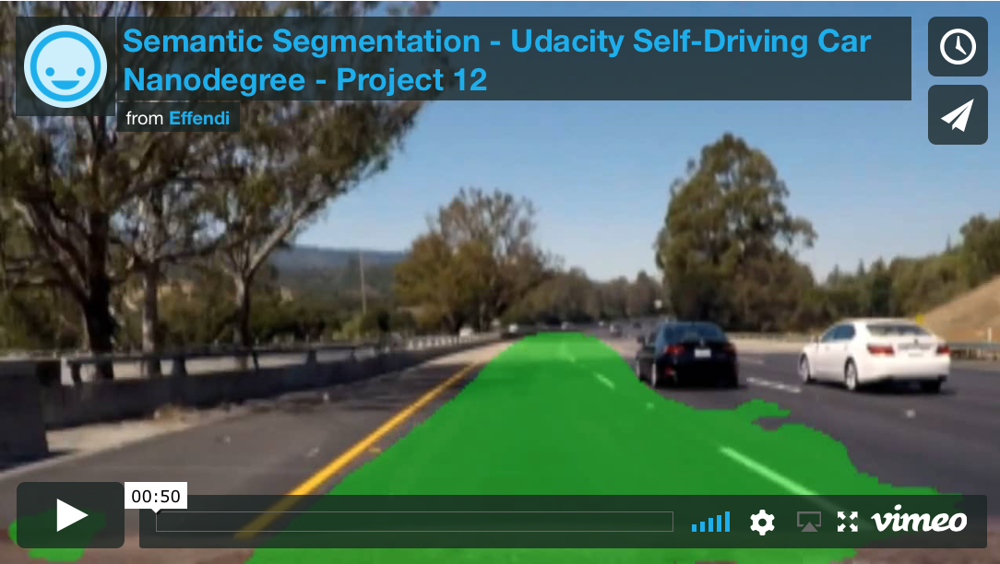

## Udacity Self Driving Car Nanodegree - All Projects ##

**Computer Vision/Deep Learning**

- [Finding Lane Lines on the Road](#1-finding-lane-lines-on-the-road) - Color filtering, Canny edge detection, Hough transform
- [Traffic Sign Recognition](#2-traffic-sign-recognition) - Neural Net classifier, CNNs
- [Behavioral Cloning](#3-behavioral-cloning) - End-to-end deep learning
- [Advanced Lane Finding](#4-advanced-lane-finding) - Camera calibration, LAB color space, Sobel gradients
- [Vehicle Detection](#5-vehicle-detection) - HOG, SVMs, sliding window search
- [Semantic Segmentation](#12-semantic-segmentation) - FCNs, driveable area detection

**Sensor Fusion/Localization**

- [Extended Kalman Filter](#6-extended-kalman-filter) - Nonlinear Jacobian state linearization
- [Unscented Kalman Filter](#7-unscented-kalman-filter) - Nonlinear sigma point transformation
- [Particle Filter Localization](#8-particle-filter-localization) - 2D Gaussian probability sampling

**Control Actuation**

- [PID Control](#9-pid-control) - Closed loop feedback, twiddle auto-tuning
- [MPC Control](#10-mpc-control) - Receding horizon optimization, actuation delay

**Motion Planning**

- [Path Planning](#11-path-planning) - Frenet interpolation, JMT, collision risk prediction, freeway lane changing

**System Integration (Final Team Project)**

- [Capstone Self-Driving Lincoln MKZ](#13-capstone-self-driving-lincoln-mkz) - ROS, traffic light detection, path planning, drive-by-wire

---

#### 1. Finding Lane Lines on the Road ####

https://github.com/edufford/CarND-LaneLines-P1/blob/master/P1_writeup.md

  

---

### 2. Traffic Sign Recognition ###

https://github.com/edufford/CarND-Traffic-Sign-Classifier-P2/blob/master/writeup_P2.md

 

---

### 3. Behavioral Cloning ###

https://github.com/edufford/CarND-Behavioral-Cloning-P3/blob/master/writeup_P3.md

 

---

### 4. Advanced Lane Finding ###

https://github.com/edufford/CarND-Advanced-Lane-Lines-P4/blob/master/writeup_P4.md

  

---

### 5. Vehicle Detection ###

https://github.com/edufford/CarND-Vehicle-Detection-P5/blob/master/writeup_P5.md

---

### 6. Extended Kalman Filter ###

https://github.com/edufford/CarND-Extended-Kalman-Filter-P6

---

### 7. Unscented Kalman Filter ###

https://github.com/edufford/CarND-Unscented-Kalman-Filter-P7

---

### 8. Particle Filter Localization ###

https://github.com/edufford/CarND-Particle-Filter-Localization-Kidnapped-Vehicle-Project-P8

---

### 9. PID Control ###

https://github.com/edufford/CarND-PID-Control-Project-P9/blob/master/Reflection.md

---

### 10. MPC Control ###

https://github.com/edufford/CarND-MPC-Project-P10/blob/master/Reflection.md

---

### 11. Path Planning ###

https://github.com/edufford/CarND-Path-Planning-Project-P11

---

### 12. Semantic Segmentation ###

https://github.com/edufford/CarND-Semantic-Segmentation-Project-P12

---

### 13. Capstone Self-Driving Lincoln MKZ ###

https://github.com/team-fusionx/CarND-Capstone

